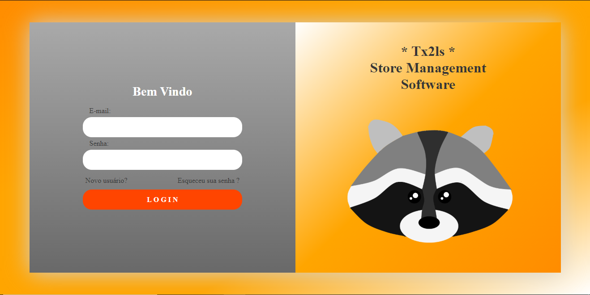
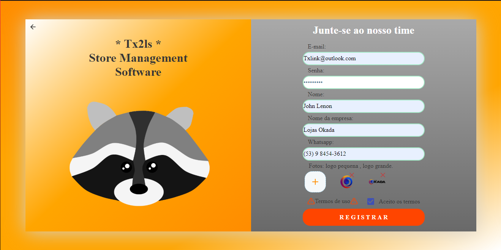
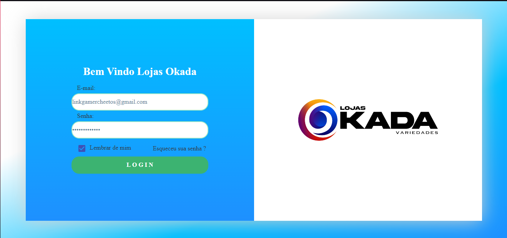
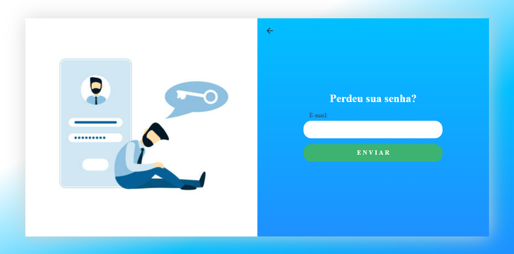
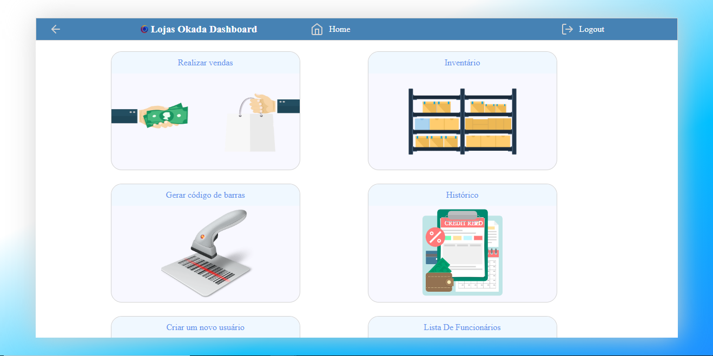
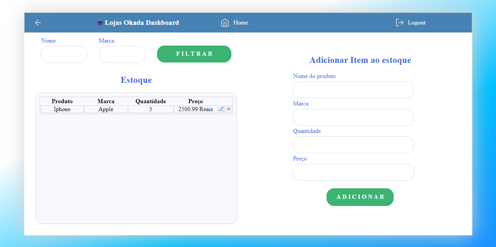
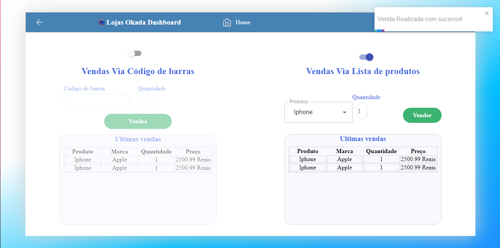
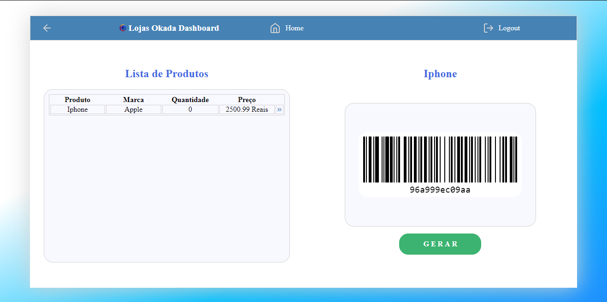
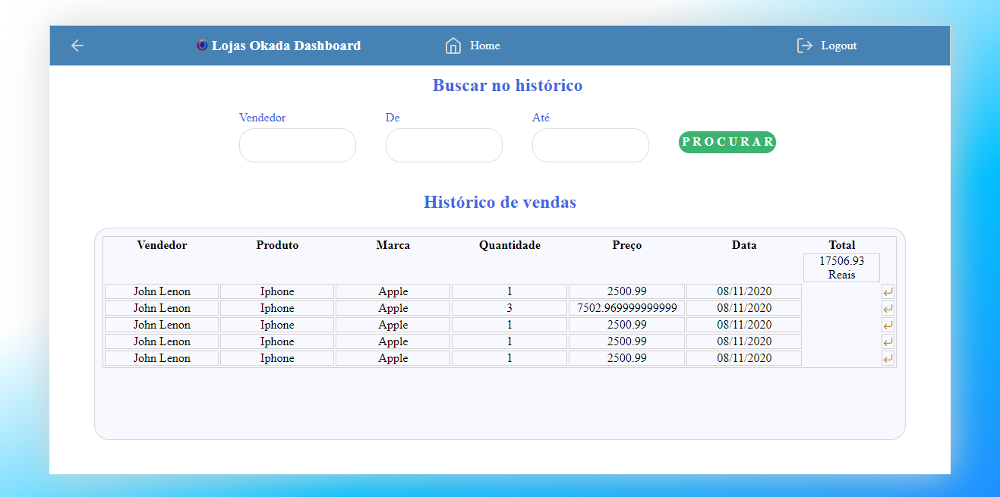

<h1 align="center" >
  Tx2l's SMS
  
</h1>

<p align="center">Software para gerenciamento de lojas</p>


<p align="center">
 <a href="#-sobre">Sobre</a> •
 <a href="#-layout">Layout</a> • 
 <a href="#-executando-o-Tx2l's-SMS">Como executar</a> • 
 <a href="#-tecnologias">Tecnologias</a> • 
 <a href="#-autora">Autor</a> 
</p>

---

## 💡 Sobre

Essa aplicação permite que, seja cadastrada uma empresa essa essa empresa possa controlar seu estoque, vendas e funcionarios. Tudo isso visando uma melhor administração do seu negocio.

Este projeto foi desenvolvido como um trabalho freelancer e postado com as devidas permissões.

---

## 🎨 Layout


### Web

<p align="center">
                                Landing
  
                                Registro de empresas
  
                                Login de funcionários 
  
                                 Recuperação de senha 
  
                                Dashboard
  
                                Controle de estoque
  
                                Controle de vendas
  
                                Geração de código de barras
  
                                Controle de vendas realizadas
  
                                Cadastro de funcionários
  
                                Controle de funcionários
  
</p>
<br>


## 👌 Funcionalidades


* Registro de empresas
   * Usuários podem registrar suas empresas
   * Usuários devem confirmar seu e-mail para ter acesso as funcionalidades do software
*  Login
   *  Usuários devem realizar login com suas credenciais para utilizar o software 
   * Usuários podem recuperar sua senha informando seu e-mail
   
* Dashboard
    *  Controle de vendas
        * Usuários podem realizar vendas via código de barras
        * Usuários podem realizar vendas via lista de produtos
    *  Controle de estoque
        * Usuários podem registrar produtos ao estoque
        * Usuários podem atualizar produtos do Estoque
        * Usuários podem remover produtos do Estoque
    *  Controle de vendas realizadas
        * Usuários podem listar todas as vendas
        * Usuários podem filtar as vendas por vendedor ou data
        * Usuários podem reverter uma venda devolvendo o produto ao estoque
    *  Geração de código de barras
        * Usuários podem gerar código de barras para os produtos do seu estoque
    *  Registro de funcionários
        * Usuários podem registrar novos funcionários em suas empresas
    *  Controle de funcionários
        * Usuários podem listar todos os funcionários
        * Usuários podem filtar os funcionários por nome
        * Usuários podem demitir um funcionário
<br>
---

## 💻 Executando o Tx2l's SMS

### Pré-requisitos

É necessário ter instalado na sua máquina para execução desse projeto:
- NodeJS
- Gerenciador de pacotes (Npm ou Yarn) 
- Banco de dados postgreSQL(Local ou através de docker)
  - caso opte por instalar o docker este é um tutorial de instalação      
   [](https://www.notion.so/Instala-o-do-Docker-8230846ae2c547b2988f2aca91fc1edf)
  - Com o docker instalado será necessário criar um container postgreSQL através do comando 
  ```bash 

    $ docker run --name nome -e POSTGRES_PASSWORD=senha -p 5432:5432  -d postgres

    ```
    - O retorno será o id do container criado e isso indica que tudo está funcionando 
    - Agora será preciso acessar o banco de dados através de um software adequado (Beekeeper studio,DBeaver) e criar um banco de dados que sera usado no .env
  

### ♊ Clonando o Repositório

```bash

$ git clone https://github.com/johnldev/Tx2ls-SMS

# entre na pasta do projeto

$ cd Tx2ls-SMS

```
### 💻 Rodando o Happy web

Entre na pasta

```bash

$ cd Front-end

```
Instale as dependências

```bash

$ yarn

# ou, caso use npm

$ npm install

```

Rode a aplicação

```bash

$ yarn start

# ou, caso use npm

$ npm run start

```


### 🌐 Rodando o Servidor

Entre na pasta

```bash

$ cd Back-end

```
Instale as dependências

```bash

$ yarn

# ou, caso use npm

$ npm install

```

- Nesse momento crie um arquivo .env na raiz do projeto e o preencha com os dados do seu banco de dados utilizando o arquivo .env-example como exemplo

Modele o banco de dados

```bash

$ yarn typeorm migration:run

# ou, caso use npm

$ npm run typeorm migration:run

```

Rode o servidor

```bash

$ yarn dev:server

# ou, caso use npm

$ npm run dev:server

```

<br>

Caso você tenha interesse em usar o serviço de envio de emails sendgrid, será necessário a criação de uma conta gratuita no mesmo, após isso deve-se incluir a API_KEY no arquivo .env e trocar o email nas configurações de email.

Se tudo deu certo, o app deve estar disponível agora! 👩‍🔧

---

## 🛠️ Tecnologias

As ferramentas usadas no desenvolvimento do projeto.

#### Backend:
- Uuid
- Typescript
- NodeJS
- Express
- PostgreSQL
- TypeORM
- Yup
- Nodemailer
- Multer
- JsonWebToken
- Bcriptjs
- Tsyringe
- Date-fns

#### Web
- Typescript
- ReactJS ⚛️
- React Router Dom
- React Icons
- JsBarcode
- Toastify
- Yup
- Material Ui
- Styled Components
- Axios

---